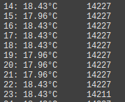
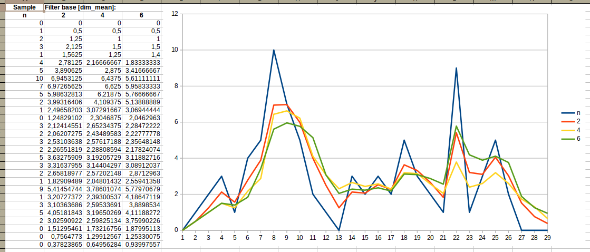
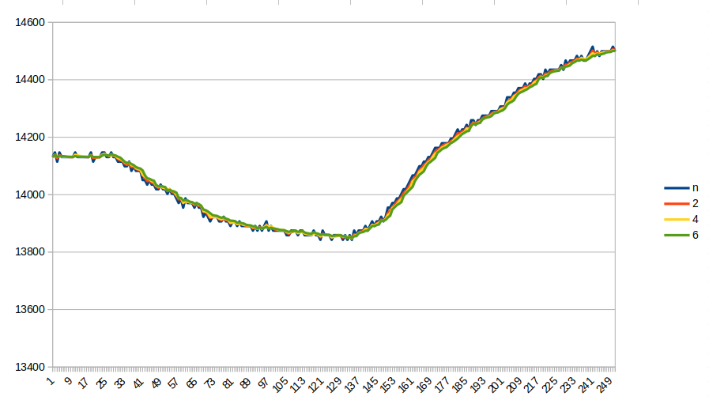
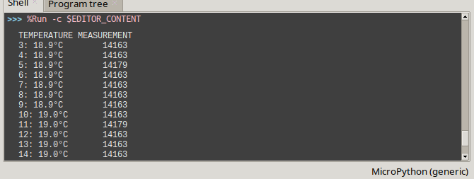

# Internal sensor temperature measurement
Filter for sensors with pipico or python3

## Measurement of ambient temperature with the internal sensor of the module

### version 0.1, 0.2

The *temperature* sensor is available through ***ADC4*** only available in software. The sensor, being permanently connected to the module, *rather* ***is not suitable for measuring the ambient temperature*** because it has a high thermal inertia (probably depending on the mass of the entire module). The time to establish a reliable temperature display is *several minutes*.

Probably this *temperature sensor* is designed for not very accurate measurements when the module works in the so-called *severe conditions*, where due to the operation of his quartz generator, *the temperature must be stabilized*. Although its generator in "room" conditions is stable, it still depends on the ambient temperature.

The disadvantage of this sensor is that it records even *the smallest temperature changes resulting from the operation of the processor itself*, superimposed on the ambient temperature. As a result, the *ADC4* data stream is somewhat or even more chaotic, even though the tested ambient temperature does not change in this way.



The test temperature expressed in **degrees Celsius** is displayed in the *Thonny* terminal. At the time of measurement, *LED* lights up for a moment on *GPIO25*. The temperature is calibrated with the variable *clb*. It must be established in relation to the thermometer (several minutes after being connected to the power supply).

### version 0.2

In order to control (from my point of view) *random temperature values* I added to the script ***an averaging filter***, which removed the noise a bit. The *mean2()* filter function has the *dim_mean* argument, the value of which can be set to *the averaging base* in the range of 2 or more (but without exaggeration), which affects the filtering strength.

First, I tested the filter algorithm on a randomly generated data set. In filter *base* was set to *2, 4, 6*, *n* is raw data, so you can see the effect on the chart:



However, the flux from a real sensor does not look like this, so I made a plot for the real data set:



When set to *base* >20, the ***filter proved to be very effective***.

Since there were single samples in the stable data stream, suddenly larger or smaller, I added a second filter, or rather a value corrector *pic_correction()*. This feature has already stabilized the sensor data stream.



I added the ability to display the temperature in degrees ***Fahrenheit***, for which the function *deegres2fahrenheit()* is responsible.

### version 0.3

Then I wrote the filter as a module with *classs*: *sensorfilter()*, filter property *mean2* and an additional correction filter *pic_correction()* (see listing). Thanks to this, the algorithm has retained the clear structure of the legendary *blink*, and you can create separate filter objects for several sensors.

There are three lines in the *main.py* code to experiment with, with different ways to use the *dp_filters.py* module. It is enough to mark two of the lines as a comment:

```python
#fil_tp= tp.read_u16()        #raw
fil_tp= sr_adc4.mean2(tp.read_u16(), 30)    #filter
#fil_tp= sr_adc4.pic_correction(sr_adc4.mean2(tp.read_u16(), 30)) #filter 2 level
```
## Installation

With *Thonny* you have to put *dp_filters.py* in */lib* directory (If there is no */lib* directory in the module, you need to create one). *Main.py* script to the root directory.

## End

I wanted to "simplify life" and add *ADC4* port support to the *mean2* function, but I gave up on that as the code of the module would ***not be portable***.
*Class* module - was written so that **it can work with python 3 or higher, in micropython or circuitpython** (not tested). I read the temperature of the *pipico* module through the serial port (USB) and processed the stream in *python3* using the *dp_filters* module. But that's another topic.
